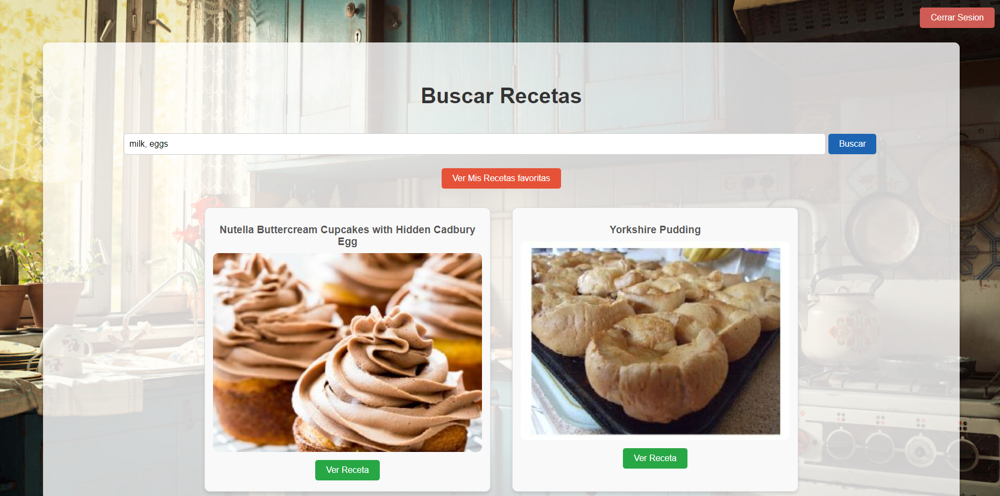
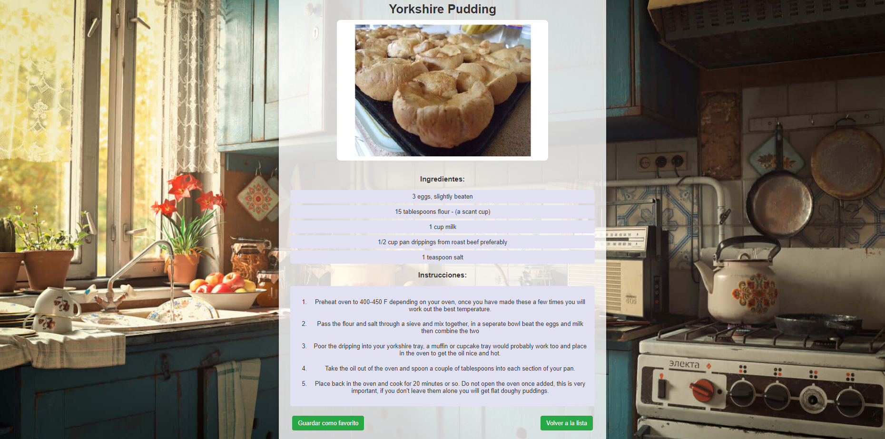
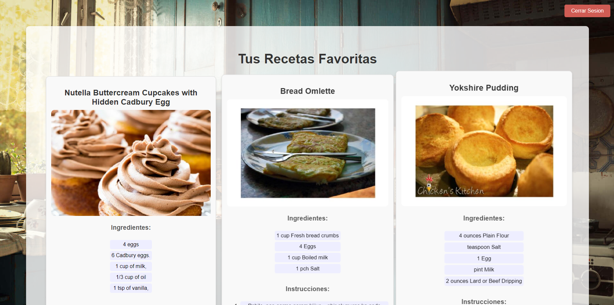

# Buscador de Recetas 🍽️

Este es un proyecto de una plataforma web que permite a los usuarios buscar recetas basadas en los ingredientes que tienen, ver los detalles de las recetas y guardarlas como favoritas. Utiliza la API de Spoonacular para obtener las recetas, React para la interfaz de usuario, y Firebase Authentication para la autenticación de usuarios.

## Información del Proyecto 📚

Este proyecto es parte de mis prácticas de desarrollo de software, donde he aplicado mis habilidades en programación y diseño de aplicaciones web. A través de este proyecto, he trabajado en:

- **Frontend**: React.js para la creación de la interfaz de usuario.
- **Backend**: API de Spoonacular para la obtención de recetas.
- **Autenticación**: Firebase Authentication para la gestión de usuarios.
- **Almacenamiento local**: localStorage para guardar recetas favoritas.

## Características principales 📋

- 🔍 **Búsqueda de recetas**: Los usuarios pueden buscar recetas ingresando ingredientes y recibir una lista de recetas relevantes.
- 📋 **Ver detalles de recetas**: Cada receta incluye detalles como ingredientes, instrucciones y una imagen representativa.
- ⭐ **Guardado de recetas favoritas**: Los usuarios autenticados pueden guardar recetas como favoritas para verlas más tarde.
- 🔑 **Autenticación**: Integración con Firebase Authentication para el registro e inicio de sesión de usuarios.

## Tecnologías Utilizadas 🛠️

- React
- Firebase
- Axios
- CSS

## Capturas de Pantalla 📸

### 🔎 Página de Búsqueda de Recetas


### 📖 Detalles de la Receta


### ⭐ Página de Favoritos


## Instalación y configuración 🚀

1. Clona el repositorio:

``` bash
git clone: https://github.com/Eduarvallejos/Buscador-De-Recetas

```

2. Instala las dependencias del proyecto:

``` bash
npm install

```

3. Configura Firebase Authentication:

- Crea un proyecto en ``Firebase``.
- Habilita el método de autenticación por correo electrónico y contraseña.
- Agrega tu configuración de Firebase en un archivo ``firebase.js``.

4. Obtén una API key de ``Spoonacular`` y añádela en los archivos necesarios (``RecipeSearch.js`` y ``RecipeDetails.js``).

5. Inicia el proyecto en modo de desarrollo:

``` bash
npm start

```
El proyecto estará disponible en ``http://localhost:3000``.

## Estructura del proyecto 📂

``` bash
/src
 ├── /components
 │    ├── RecipeSearch.js        # Componente de búsqueda de recetas
 │    ├── RecipeDetails.js       # Componente de detalles de recetas
 │    ├── RecipeList.js          # Componente que muestra la lista de recetas
 │    ├── LogoutButton.js        # Componente que muestra el Boton de cerrar sesión
 │    └── FavoritesPage.js       # Página de recetas favoritas
 ├── /firebase
 │    └── firebase.js            # Configuración de Firebase
 ├── App.js                      # Componente principal
 ├── index.js                    # Punto de entrada de la aplicación
 └── App.css                     # Estilos generales

```

## Uso del proyecto 🎮

1. **Buscar recetas**: En la página principal, ingresa ingredientes en el campo de búsqueda y haz clic en "Buscar".
2. **Ver detalles de la receta**: Haz clic en "Ver Receta" para obtener más detalles, como los ingredientes y las instrucciones.
3. **Guardar recetas favoritas**: Inicia sesión o regístrate para guardar recetas como favoritas y visualizarlas en la sección de "Favoritos".

## Futuras mejoras 🚀

- Migración de la funcionalidad de recetas favoritas a una base de datos en lugar de localStorage.

## Licencia 📜
Este proyecto está bajo la licencia MIT. Puedes ver más detalles en el archivo ``LICENSE``.